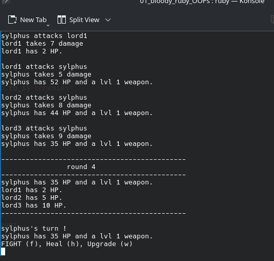

# bloody_ruby_OOPs

## Project description

This project is about learning to use objects in ruby while crating a small fighting RPG.

There are 3 different programs :

### app.rb

automatically simulates a fight between two bots until one of them dies.

### app2.rb

This one is based on the above one, but features are introduced
- Adds a new category of player : HumanPlayer
- Allows the user to fight bots through strategic inputs
- allows user to define the number of ennemies
- The user can either
    - heal
    - fight
    - upgrade weapon
- The combat continues until either the player or all of the ennemies die.

#### Speedrun

You can **spam enter** to make the program play by itself.
- Number of ennemies will be set between 1 and 6
- Username will be systems username
- The living ennemies will be attacked randomly

# Visual

# Credits

This program is done within the cursus of The Hacking Project